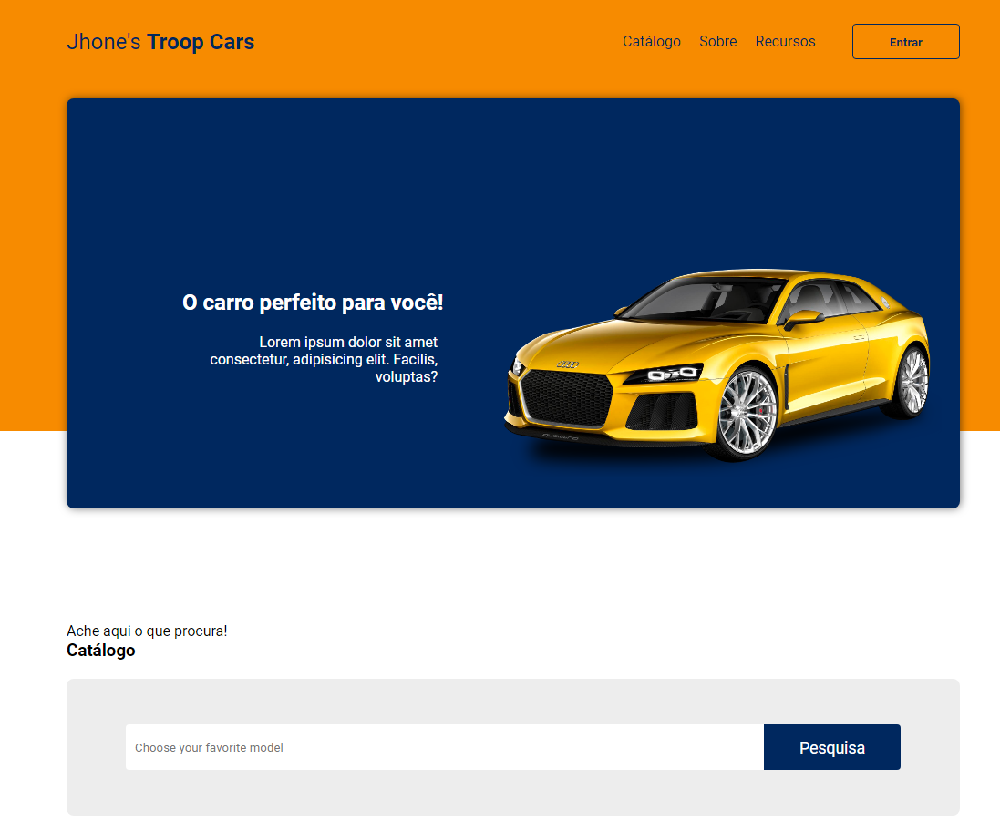

## Projeto Catálogo (Em desenvolvimento 🛠️)

#### Este projeto foi inspirado em um vídeo do canal [DevSuperior](https://www.youtube.com/c/DevSuperior)!

## 🎯 Objetivo

O projeto consiste em desenvolver uma landing page de uma empresa de vendas de veículos, de acordo com o layout disponibilizado no [Figma](https://www.figma.com/file/zEdDGF7hn1AOmZHfI04Sz6/devClass_001_HTML_CSS?node-id=0%3A1).

## 💻 Tecnologias utilizadas

Para o desenvolvimento deste site utilizei as seguintes tecnologias:

- HTML;
- CSS;

## ⚙️ Ajustes e melhorias

O projeto ainda está em desenvolvimento e as próximas atualizações serão voltadas nas seguintes tarefas:
- 🛠️ Adição do Javascript (Próximas atualizações)
- 🛠️ Criar Modal de Dados pessoais ao botão "Eu quero!"
- 🛠️ Criar Slide nas imagens dos veículos
- 🛠️ Adicionar uma lista de veículos diferente
